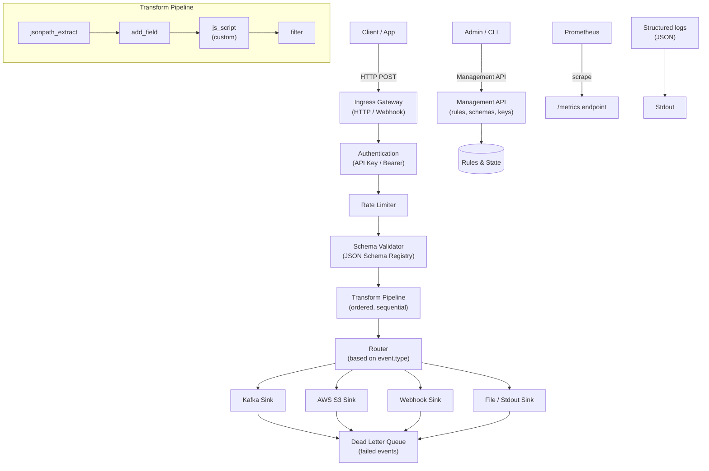

# EventFlow

[
[](https://github.com/eventflow/eventflow/releases)
[](https://goreportcard.com/report/github.com/eventflow/eventflow)
[](./LICENSE)
[](./README.md)

**EventFlow** is an open-source, real-time event processing pipeline. It ingests JSON events via HTTP/webhooks, validates them against JSON Schemas, applies pluggable transforms, and forwards events to multiple sinks (Kafka, S3, webhooks, etc.). Built in Go, it's designed for low-latency, high-throughput, and operational simplicity.

## Table of Contents

- [Features](#features)
- [Architecture](#architecture)
- [Quick Start (30 seconds)](#quick-start-30-seconds)
- [Documentation](#documentation)
- [License](#license)
- [Community & Support](#community--support)

---

## Features

- **HTTP ingestion** – REST API with API key authentication, rate limiting, and idempotency.
- **JSON Schema validation** – Enforce event structure per event type.
- **Pluggable transforms** – Built-in transforms + QuickJS scripting for custom logic.
- **Multiple sinks** – Kafka, AWS S3, webhooks, file, stdout, with dead-letter queue support.
- **Operational readiness** – Prometheus metrics, structured logging, health checks.
- **Management API** – Manage rules, schemas, and API keys at runtime.
- **CLI tool** – Validate configs, test transforms, generate keys.
- **Scalable** – Stateless design, horizontal scaling, backpressure handling.

---

## Architecture

Below is a high-level architecture diagram of EventFlow. It shows the flow of an event from ingestion through validation, transformation, and routing to configured sinks.



---

## Quick Start (30 seconds)

```bash
# Start EventFlow with default configuration
docker run --rm -p 8080:8080 eventflow/eventflow:latest

# In another terminal, send a test event
curl -X POST http://localhost:8080/v1/events \
  -H "Content-Type: application/json" \
  -H "X-API-Key: dev-key" \
  -d '{"id":"evt-1","type":"page_view","timestamp":"2026-06-13T12:00:00Z","data":{"page":"/home","user":"alice"}}'
```

---

## Documentation

| Section | Description |
|---|---|
| [Installation](getting-started/installation.md) | Install via binary, Docker, or source |
| [Quickstart](getting-started/quickstart.md) | 5-minute walkthrough |
| [Configuration](getting-started/configuration.md) | Full configuration reference |
| [User Guide](user-guide/sending-events.md) | Sending events, transforms, sinks, monitoring |
| [API Reference](api/overview.md) | REST management API |
| [Operations](operations/deployment.md) | Deploying, scaling, troubleshooting |
| [Development](development/contributing.md) | Contributing, local setup, testing |
| [CLI Reference](reference/cli.md) | Command-line tool reference |

---

## License

EventFlow is open source under the [MIT License](./LICENSE).

---

## Community & Support

- [GitHub Issues](https://github.com/eventflow/eventflow/issues) – bug reports and feature requests
- [Discord](https://discord.gg/eventflow) – community chat
