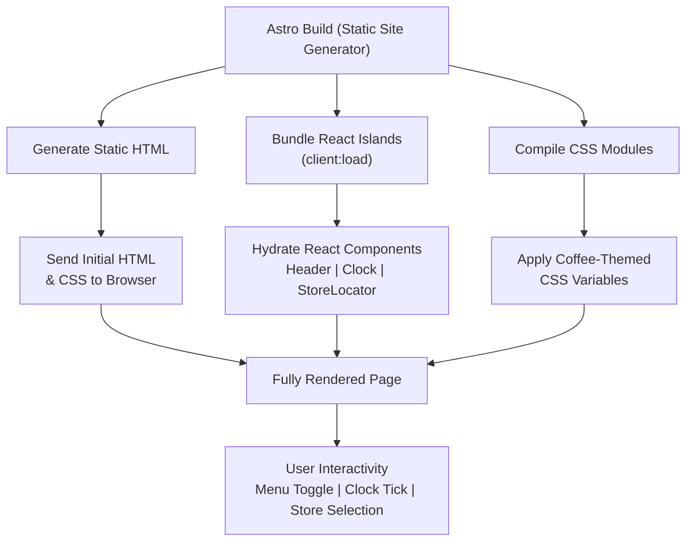

# CyZerO — Seoul Coffee Archive

> **A brand storytelling website** built with Astro and React, showcasing Seoul's premium coffee culture through immersive visual design, interactive components, and a curated product collection.

[](https://astro.build)
[](https://reactjs.org)
[](https://www.typescriptlang.org)
[](LICENSE)

---

## Architecture Overview



---

## Quick Start

```bash
# 1. Navigate to the Astro project
cd astro

# 2. Install dependencies
npm install

# 3. Start the development server
npm run dev
```

Your site will be available at **`http://localhost:4321`**.

---

## Project at a Glance

| Aspect | Details |
|--------|---------|
| **Type** | Static marketing / brand showcase website |
| **Framework** | Astro v5.5.0 (static output) + React 18 islands |
| **Language** | TypeScript 5 (strict mode) |
| **Styling** | Modular CSS with custom properties (no Tailwind/Sass) |
| **Hydration** | Selective — `client:load` on Header, Clock, StoreLocator |
| **Fonts** | Pretendard, SUIT, JetBrains Mono, Noto Sans KR (CDN) |
| **Deployment** | Any static host (Netlify, Vercel, Cloudflare Pages) |

---

## Pages & Components

| Route | Page | Key Components |
|-------|------|----------------|
| `/` | Home | Hero, BrandStory, FeaturedProducts, CoffeeProductGrid, QualityStory, StoreLocator, InstagramFeed, NewsSection, Footer |
| `/clock` | Analog + Digital Clock | Clock (React), Header |
| `/slider` | Vertical Image Showcase | 6 images + Header |

---

## Table of Contents

### Getting Started
- [Installation](getting-started/installation.md)
- [Development](getting-started/development.md)
- [Build & Deploy](getting-started/build-and-deploy.md)
- [Project Structure](getting-started/project-structure.md)

### Architecture
- [Overview](architecture/overview.md)
- [Component Hydration](architecture/component-hydration.md)
- [Routing](architecture/routing.md)
- [Styling System](architecture/styling-system.md)

### Components
- [React Components](components/react-components.md)
- [Astro Components](components/astro-components.md)
- [Header & Menu](components/header-and-menu.md)
- [Clock](components/clock.md)
- [Store Locator](components/store-locator.md)
- [Coffee Product Grid](components/coffee-product-grid.md)
- [CoffeeLoader Animation](components/coffeeloader-animation.md)

### Styling
- [Color Palette](styling/color-palette.md)
- [Typography](styling/typography.md)
- [Responsive Breakpoints](styling/responsive-breakpoints.md)
- [CSS Architecture](styling/css-architecture.md)

### Content Management
- [Updating Text](content-management/updating-text.md)
- [Adding Products](content-management/adding-products.md)
- [Managing Images](content-management/managing-images.md)
- [Editing Sections](content-management/editing-sections.md)

### Development
- [Contributing](development/contributing.md)
- [Linting & Formatting](development/linting-and-formatting.md)
- [TypeScript Guide](development/typescript-guide.md)
- [Performance Optimization](development/performance-optimization.md)

### Deployment
- [Static Hosting](deployment/static-hosting.md)
- [Environment Variables](deployment/environment-variables.md)
- [Troubleshooting](deployment/troubleshooting.md)

---

## License

This project is private and proprietary. All rights reserved — CyZerO Coffee Company Limited.
