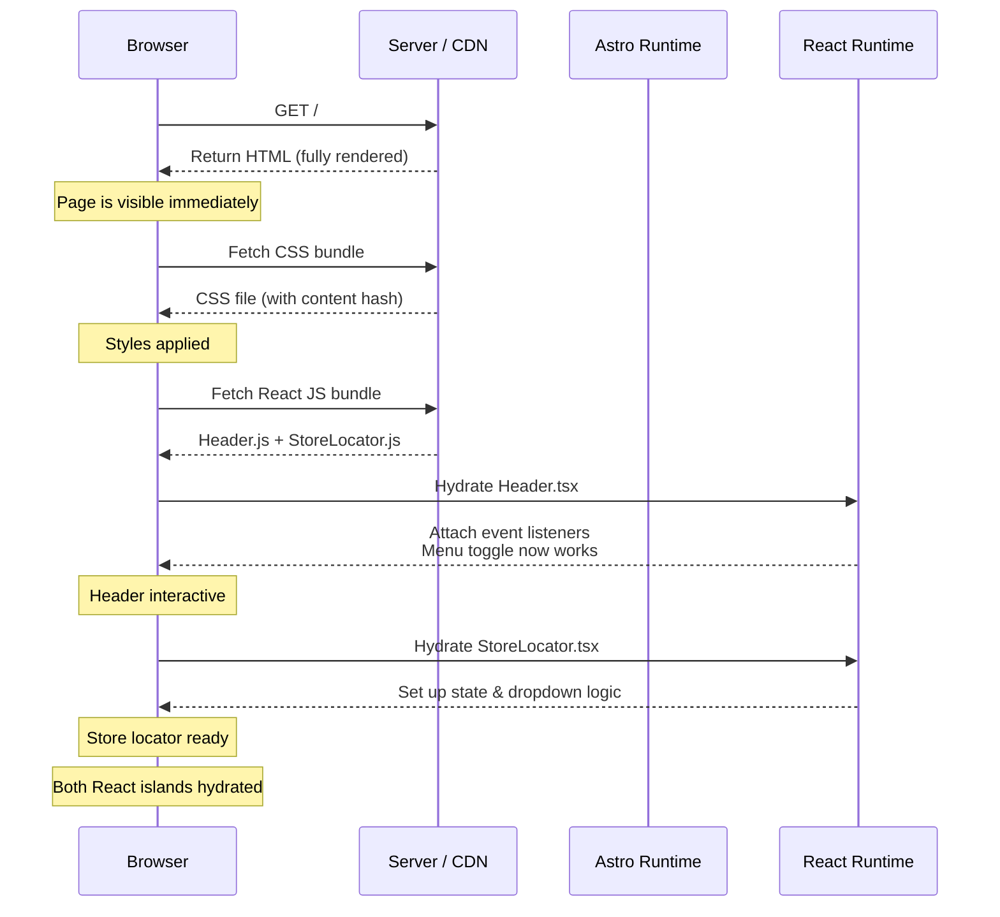

# Component Hydration

CyZerO uses Astro's **islands architecture** — the majority of the UI is static HTML generated at build time, while a few interactive React components hydrate on the client after the page loads.

---

## Hydration Timeline

The following sequence diagram shows what happens when a user visits the home page:



---

## Astro's `client:load` Directive

React components are hydrated using the `client:load` directive:

```astro
<!-- src/pages/index.astro -->
<Header client:load />
<StoreLocator client:load />
```

```astro
<!-- src/pages/clock.astro -->
<Clock client:load />
```

> **Note:** `client:load` means the component hydrates **immediately** when the page loads, not on scroll or interaction.

---

## Why These Three Components?

| Component | Reason for Hydration |
|-----------|---------------------|
| **Header** | Mobile menu requires `useState` for open/close toggling and `useEffect` for body scroll lock and window resize detection |
| **Clock** | Needs `setInterval` + `useState` to update the displayed time every second |
| **StoreLocator** | Requires `useState` for cascading dropdown selection (city → district) |

All other components are purely presentational and render fully as static HTML.

---

## The React Component Template

Every React component in this project follows the same pattern:

```tsx
import { useState, useEffect } from 'react'

export default function ComponentName() {
  // 1. State
  const [state, setState] = useState(initialValue)

  // 2. Side effects
  useEffect(() => {
    // Setup (e.g., event listeners, intervals)
    return () => {
      // Cleanup (e.g., remove listeners, clear intervals)
    }
  }, [])

  // 3. Render
  return <div>...</div>
}
```

---

## Bundle Size Impact

| Component | Estimated JS Size | Notes |
|-----------|-------------------|-------|
| Header | ~3 KB | Menu state + resize listener + scroll lock |
| Clock | ~4 KB | Interval + angle math + date formatting |
| StoreLocator | ~3 KB | Dropdown state + list data |

**Total React JS:** ~10 KB gzipped — negligible performance impact.

---

## Best Practices

- **Keep React islands small** — only hydrate what needs interactivity
- **Use `client:load` sparingly** — prefer static HTML whenever possible
- **Clean up effects** — always return a cleanup function from `useEffect`
- **Avoid prop drilling** — each island is self-contained with its own state

---

## Next Steps

- [React Components](../components/react-components.md) — detailed API for each component
- [Performance Optimization](../development/performance-optimization.md) — bundle analysis and tips
