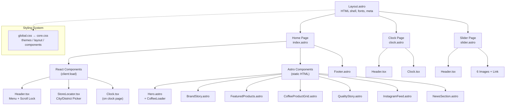

# Architecture Overview

The CyZerO website follows a **static site architecture** powered by Astro. Every page is pre-rendered to HTML at build time, then enhanced with interactive React "islands" that hydrate in the browser.

---

## Component Hierarchy



---

## Build-Time Static Generation

Astro processes the site in three phases:

### 1. Template Compilation

- `.astro` files are compiled to HTML templates
- Frontmatter (`---` blocks) runs at build time
- React components are extracted as islands

### 2. Asset Bundling

- CSS is collected, deduplicated, and minified
- React JS is bundled via Vite (Astro's bundler)
- Images in `public/` are copied verbatim

### 3. HTML Output

- Each page is rendered to a standalone `.html` file
- React components get data attributes (`data-astro-cid-*`) for hydration
- CSS is inlined or linked as external files

---

## Static vs. Interactive

| Layer | Technology | When It Runs |
|-------|------------|-------------|
| **HTML structure** | Astro (`.astro`) | Build time |
| **CSS styling** | Plain CSS + variables | Build time (reuses in browser) |
| **React components** | React 18 + TypeScript | Client-side hydration (after page load) |
| **Dynamic content** | `useState` / `useEffect` | Runtime (Clock tick, menu toggle) |

---

## Data Flow

```
Editor (code changes)
    │
    ▼
npm run dev / npm run build
    │
    ├── Astro compiles .astro files → static HTML
    ├── Vite bundles React islands → separate .js files
    ├── CSS is processed → .css files
    └── Assets copied from public/ → dist/
    │
    ▼
dist/ folder (ready for deployment)
```

> **Note:** There is no database, CMS, or API. All content is authored directly in the component files.

---

## Key Design Decisions

| Decision | Rationale |
|----------|-----------|
| **Static output** | No server needed; fast CDN delivery; lower cost |
| **React only for interactivity** | Minimizes JS bundle size; 3 components hydrate |
| **No Tailwind / Sass** | Keeps dependencies minimal; full control over CSS |
| **CDN fonts** | No font files in repo; always up-to-date |
| **CSS custom properties** | Easy theme changes; consistent palette |

---

## Next Steps

- [Component Hydration](component-hydration.md) — how React islands load
- [Routing](routing.md) — how pages map to URLs
- [Styling System](styling-system.md) — CSS architecture in detail
