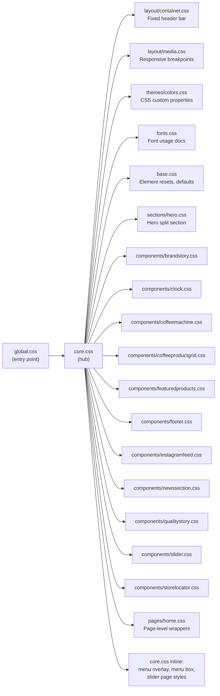

# Styling System

The CyZerO styling system is built on **modular CSS with custom properties**. There is no CSS-in-JS, no Tailwind, and no Sass — just plain CSS organized by concern.

---

## CSS Import Chain



---

## Import Order (in `core.css`)

```css
/* 1. Structural layout */
@import './layout/container.css';
@import './layout/media.css';

/* 2. Theme foundation */
@import './themes/colors.css';

/* 3. Font documentation */
@import './fonts.css';

/* 4. Base element resets */
@import './base.css';

/* 5. Components */
@import './components/slider.css';
@import './sections/hero.css';
@import './components/coffeemachine.css';
@import './components/clock.css';
@import './components/brandstory.css';
@import './components/featuredproducts.css';
@import './components/coffeeproductgrid.css';
@import './components/qualitystory.css';
@import './components/storelocator.css';
@import './components/instagramfeed.css';
@import './components/newssection.css';
@import './components/footer.css';

/* 6. Page-level */
@import './pages/home.css';

/* 7. Inline styles for overlay, menu, slider */
```

---

## CSS Custom Properties

All design tokens are defined in `themes/colors.css` on the `:root` pseudo-class:

```css
:root {
  --espresso: #2C1810;
  --dark-roast: #1A0F0A;
  --cream: #FFF8F0;
  --latte: #C9A96E;
  --caramel: #D4A574;
  /* ... see full palette in styling/color-palette.md */
}
```

### How Variables Are Used

```css
.hero-heading {
  color: var(--cream);
  background: linear-gradient(135deg, var(--latte), var(--caramel));
}

.card {
  background: var(--dark-roast);
  border: 1px solid rgba(201, 169, 110, 0.15);
  /* var(--latte) in RGB: 201, 169, 110 */
}
```

---

## Naming Convention

This project uses **descriptive class names** with a component prefix:

```
.component-name__element--modifier
```

| Example | Selector |
|---------|----------|
| Product card name | `.card-name` |
| Featured product name | `.featured-name` |
| Note tag (small) | `.note-tag-sm` |
| Origin badge | `.origin-badge` |

---

## Specificity & Scoping

- Styles are **not scoped** by Astro's built-in CSS scoping — they use global class selectors
- Component CSS files are named after their component (e.g., `clock.css` for `Clock.tsx`)
- No BEM, but class names are descriptive enough to avoid collisions
- Avoid `!important` — rely on specificity order (CSS import order in `core.css`)

---

## Media Queries

Media queries are defined in two places:

| Location | Purpose |
|----------|---------|
| `layout/media.css` | Global breakpoints (header, hero, menu, grid) |
| Per-component CSS | Component-specific responsive adjustments |
| `layout/container.css` | Header bar responsive sizing |

See [Responsive Breakpoints](../styling/responsive-breakpoints.md) for the full breakpoint table.

---

## Key CSS Files Reference

| File | Lines | What It Styles |
|------|-------|----------------|
| `coffeemachine.css` | 258 | CoffeeLoader CSS animation |
| `coffeeproductgrid.css` | 568 | Full editorial product grid |
| `hero.css` | 213 | Hero split layout + decorative overlays |
| `clock.css` | 142 | Analog clock face + digital display |
| `container.css` | 97 | Fixed header bar |
| `colors.css` | 29 | All custom properties |
| `base.css` | 37 | Element resets |

---

## Next Steps

- [Color Palette](../styling/color-palette.md) — complete variable reference
- [CSS Architecture](../styling/css-architecture.md) — deeper dive into structure
