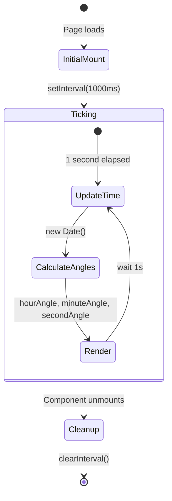

# Clock

The Clock is a React component that renders both an analog clock face and a digital time display, updating every second.

---

## Component Location

**File:** `src/components/Clock.tsx` — hydrated with `client:load` on the `/clock` page

---

## State Diagram



---

## How It Works

### 1. Time State

```tsx
const [time, setTime] = useState(new Date())
```

The `time` state holds the current `Date` object, updated every second.

### 2. Interval Effect

```tsx
useEffect(() => {
  const timer = setInterval(() => {
    setTime(new Date())
  }, 1000)
  return () => clearInterval(timer)
}, [])
```

The interval fires every 1000ms. The cleanup function prevents memory leaks on unmount.

### 3. Angle Calculation

```tsx
const hours = time.getHours()      // 0–23
const minutes = time.getMinutes()  // 0–59
const seconds = time.getSeconds()  // 0–59

const hourAngle   = (hours % 12) * 30 + minutes * 0.5   // 0.5° per minute
const minuteAngle = minutes * 6 + seconds * 0.1          // 0.1° per second
const secondAngle = seconds * 6                           // 6° per second
```

| Hand | Degrees per unit | Smooth movement |
|------|-----------------|-----------------|
| Hour | 30° per hour, 0.5° per minute | Yes |
| Minute | 6° per minute, 0.1° per second | Yes |
| Second | 6° per second | Step (no sub-second) |

### 4. Digital Formatting

```tsx
const formatTime = (value: number) => value.toString().padStart(2, '0')
const digitalTime = `${formatTime(hours)}:${formatTime(minutes)}:${formatTime(seconds)}`
// Example: "14:32:07"

const dateString = time.toLocaleDateString('en-US', {
  weekday: 'long',
  year: 'numeric',
  month: 'long',
  day: 'numeric'
})
// Example: "Saturday, June 13, 2026"
```

---

## Analog Face Structure

```
┌─────────────────────────────────┐
│         Analog Clock            │
│  ┌─────────────────────────┐    │
│  │  12 hour markers        │    │
│  │  × 9 major (every 3rd)  │    │
│  │  × 3 minor (in between) │    │
│  │                         │    │
│  │    ↔ hour hand (70px)   │    │
│  │    ↔ minute hand (100px)│    │
│  │    ↔ second hand (110px)│    │
│  │    ● center dot (12px)  │    │
│  └─────────────────────────┘    │
│                                 │
│  Digital: 14:32:07              │
│  Date: Saturday, June 13, 2026  │
└─────────────────────────────────┘
```

---

## Rotating the Hands

Each hand is a `<div>` with `transform-origin: bottom center` and rotation applied via inline style:

```tsx
<div
  className="hand hour-hand"
  style={{ transform: `rotate(${hourAngle}deg)` }}
/>
<div
  className="hand minute-hand"
  style={{ transform: `rotate(${minuteAngle}deg)` }}
/>
<div
  className="hand second-hand"
  style={{ transform: `rotate(${secondAngle}deg)` }}
/>
```

The hour markers are rotated around the clock center:

```tsx
{[...Array(12)].map((_, i) => {
  const angle = i * 30 - 90  // offset to start at 12 o'clock
  return (
    <div className={`hour-marker ${i % 3 === 0 ? 'major' : 'minor'}`}
         style={{ transform: `rotate(${angle}deg) translateY(-45%)` }} />
  )
})}
```

---

## CSS Reference

| File | Lines | Key Selectors |
|------|-------|---------------|
| `components/clock.css` | 142 | `.analog-clock`, `.clock-face`, `.hour-marker`, `.hand`, `.hand-hour`, `.minute-hand`, `.second-hand`, `.center-dot`, `.digital-time`, `.digital-date` |

---

## Responsive Behavior

On screens ≤ 768px:

```css
.analog-clock { width: 220px; height: 220px; }
.digital-time { font-size: 2.5rem; }
.hour-hand    { height: 50px; }
.minute-hand  { height: 75px; }
.second-hand  { height: 80px; }
```
