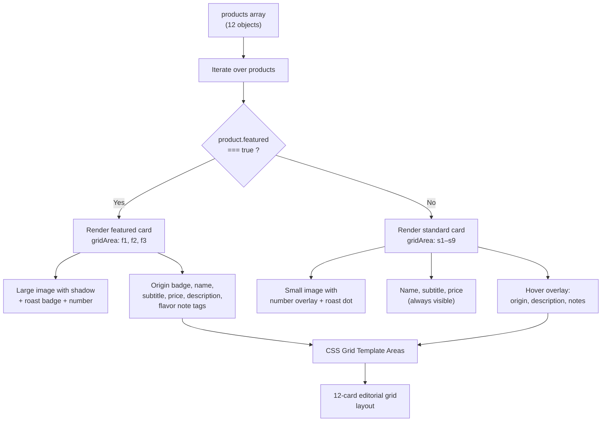

# Coffee Product Grid

The CoffeeProductGrid displays 12 products in a magazine-style editorial layout using CSS Grid Template Areas.

---

## Component Location

**File:** `src/components/CoffeeProductGrid.astro` — static Astro component (no client JS)

---

## Rendering Flow



---

## Product Interface

```tsx
interface Product {
  number: string       // "01", "02", ...
  name: string         // "Ethiopian"
  subtitle: string     // "Yirgacheffe"
  image: string        // filename in /media-assets/
  price: string        // "₩8,500"
  origin: string       // "Ethiopia"
  roast: string        // "Light", "Dark", "Cold Brew", ...
  notes: string[]      // ["Bergamot", "Honey", "Lavender"]
  description: string  // Short tasting note
  featured: boolean    // true = large card (2×2), false = small card (1×1)
  gridArea: string     // "f1", "s1", "s2", etc.
  link: string         // "#" placeholder
}
```

---

## Roast Color Mapping

```tsx
function getRoastColor(roast: string): string {
  const colors: Record<string, string> = {
    'Light':         '#D4A574',
    'Light-Medium':  '#B8864E',
    'Medium':        '#8B6914',
    'Medium-Dark':   '#6B4423',
    'Dark':          '#3E1F0D',
    'Cold Brew':     '#2C1810',
  }
  return colors[roast] || '#8B6914'
}
```

Used to color the `.roast-dot` indicator on standard cards.

---

## CSS Grid Layout

The grid uses named template areas:

### Desktop (4 columns)

```css
grid-template-areas:
  'f1  f1  s1  s2'
  'f1  f1  s3  s4'
  's5  s6  f2  f2'
  's7  s8  f2  f2'
  'f3  f3  s9  .'
  'f3  f3  .   .';
```

### Tablet (3 columns, ≤1024px)

```css
grid-template-areas:
  'f1 f1 s1'
  'f1 f1 s2'
  's3 s4 s5'
  's6 f2 f2'
  's7 f2 f2'
  's8 s9 f3'
  'f3 f3 .';
```

### Mobile (2 columns, ≤768px)

```css
grid-template-areas:
  'f1 f1'  'f1 f1'  's1 s2'  's3 s4'
  's5 s6'  'f2 f2'  'f2 f2'  's7 s8'
  's9 .'   'f3 f3'  'f3 f3';
```

### Small mobile (1 column, ≤480px)

```css
grid-template-areas:
  'f1'  'f1'  's1'  's2'  's3'  's4'
  's5'  's6'  'f2'  'f2'  's7'  's8'
  's9'  'f3'  'f3';
```

---

## Featured vs. Standard Cards

| Feature | Featured Card | Standard Card |
|---------|---------------|---------------|
| **Size** | 2×2 grid cells | 1×1 grid cell |
| **Image** | Large (70% width, centered) | Smaller (65%, with padding) |
| **Details** | Always visible | Always visible (name, price) |
| **Hover** | Scale + rotate image | Overlay slides in with full details |
| **Number** | Top-left, large (3.5rem) | Top-right, small (1.2rem) |
| **Roast** | Badge top-right | Colored dot top-left |

---

## Image Path Convention

Images are stored in `public/media-assets/` and referenced by filename:

```astro

```

| Product | Image File |
|---------|------------|
| Ethiopian Yirgacheffe | `coffee.png` |
| Peach Blossom | `macchiato.png` |
| Apricot Dream | `coldbrew.png` |
| Snow Kumquat | `hotcappuccino.png` |
| ... | ... |

---

## Adding a Product

See [Adding Products](../content-management/adding-products.md) for the complete step-by-step guide.
