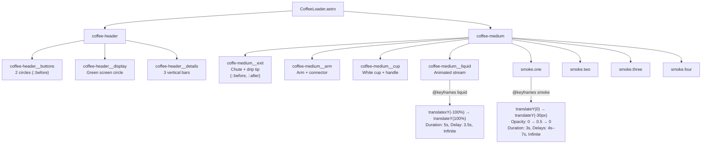

# CoffeeLoader Animation

The CoffeeLoader is a pure CSS animated coffee machine that plays automatically in the right half of the Hero section.

---

## Component Location

**File:** `src/components/CoffeeLoader.astro` — static Astro component, no JavaScript

---

## DOM Structure & CSS Animation Flow



---

## Keyframe Animations

### Liquid Stream

```css
@keyframes liquid {
  0%   { transform: translateY(-100%); }  /* Hidden above */
  10%  { transform: translateY(0); }      /* Appears at top */
  90%  { transform: translateY(0); }      /* Flows steadily */
  100% { transform: translateY(100%); }   /* Reaches bottom */
}
```

Applied to `.coffee-medium__liquid::before`:

```css
.coffee-medium__liquid::before {
  background-color: #74372b;        /* Dark brown liquid */
  animation: liquid 5000ms linear 3500ms infinite normal both;
}
```

The 3.5s delay allows the smoke to begin before liquid drops.

### Smoke Wisps

```css
@keyframes smoke {
  0%   { transform: translateY(0px);  opacity: 0; }
  40%  { opacity: 0.5; }
  50%  { transform: translateY(-10px); opacity: 0.3; }
  80%  { opacity: 0.5; }
  100% { transform: translateY(-30px); opacity: 0; }
}
```

Four smoke elements with staggered delays:

| Element | Position | Animation Delay |
|---------|----------|-----------------|
| `.smoke.one` | Bottom-left (102px, left) | 5s |
| `.smoke.two` | Bottom-left (118px, left) | 4s |
| `.smoke.three` | Bottom-right (118px, right) | 7s |
| `.smoke.four` | Bottom-right (102px, right) | 6s |

---

## Component Structure (Visual)

```
┌─────────────────────────────────┐
│         Coffee Header           │
│  ○ ○    ◉ (green)   │ │ │      │
│  buttons  display    details    │
├─────────────────────────────────┤
│                                 │
│         Coffee Medium           │
│  ┌───────┐                      │
│  │ Chute │── Arm ──┐            │
│  └───────┘          │           │
│       ↓ liquid      │           │
│   ☕ (cup) ←────────┘           │
│                                 │
│  ~ ~ ~ smoke wisps ~ ~ ~        │
└─────────────────────────────────┘
```

---

## Styling Reference

| File | Lines | Key Selectors |
|------|-------|---------------|
| `components/coffeemachine.css` | 258 | `.loader`, `.coffee-header`, `.coffee-medium`, all child elements, `@keyframes liquid`, `@keyframes smoke` |

---

## Responsive Scaling

The loader is scaled to 80% of its original size via CSS transform:

```css
.loader {
  scale: 0.8;
}
```

---

## Accessibility

The component has `aria-hidden="true"` since it is purely decorative:

```astro
<div class="loader" aria-hidden="true">
```

---

## Customization

| Element | CSS Variable / Value | Change to... |
|---------|---------------------|--------------|
| Liquid color | `#74372b` in `.coffee-medium__liquid::before` | Any hex color |
| Liquid speed | `5000ms` in `animation` property | Faster/shorter duration |
| Smoke color | `#b3aeae` in `.smoke` | Any hex color |
| Smoke intensity | `opacity` values in `@keyframes smoke` | Adjust max opacity |
| Machine body | `#ddcfcc` in `.coffee-header`, `#bcb0af` in `.coffee-medium` | Any color |
