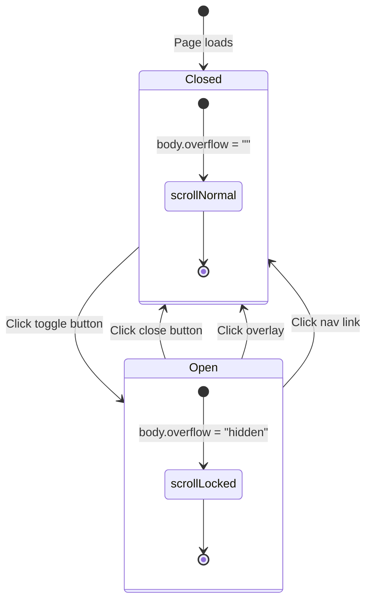

# Header & Menu

The Header is a React component that provides a fixed top navigation bar with a slide-in mobile menu.

---

## Component Location

**File:** `src/components/Header.tsx` — hydrated with `client:load`

---

## State Management

| State | Type | Initial | Purpose |
|-------|------|---------|---------|
| `open` | `boolean` | `false` | Tracks whether the slide-in menu is open |
| `iconSrc` | `string` | `"/media-assets/nav/menu.png"` | Swaps between menu and close icons |
| `isMobile` | `boolean` | `false` | Detects viewport width < 768px |

---

## Effects

### Resize Listener

```tsx
useEffect(() => {
  const check = () => setIsMobile(window.innerWidth < 768)
  check()
  window.addEventListener('resize', check)
  return () => window.removeEventListener('resize', check)
}, [])
```

Updates `isMobile` on window resize and cleans up the listener on unmount.

### Body Scroll Lock

```tsx
useEffect(() => {
  document.body.style.overflow = open ? 'hidden' : ''
  return () => { document.body.style.overflow = '' }
}, [open])
```

Prevents background scrolling when the menu is open. Restores scrolling when the menu closes.

---

## Render Structure

```
<header class="container">          ← Fixed top bar
  <div class="logo">                ← Logo linking to /
    
  </div>
  <div class="box">
    <button onClick={toggle}>       ← Toggle button
               ← menu.png / close.png
    </button>
  </div>
</header>

<div class="menu-overlay" />        ← Dark backdrop (click to close)

<div id="main-menu">                ← Slide-in panel
  <button class="menu-close">×</button>
  <ul>
    <li><a href="/">Home</a></li>
    <li><a href="/slider">Showcase</a></li>
    <li><a href="/clock">Clock</a></li>
    <li><a href="#">Journal</a></li>
  </ul>
</div>
```

---

## State Diagram: Menu Open/Close



---

## Menu Width Logic

The menu width depends on viewport:

```css
/* Desktop: 35% width */
.menu-box.open-menu { width: 35%; }

/* Mobile: 100% width */
.menu-box.open-menu.mobile-full { width: 100%; }
```

The class `mobile-full` is conditionally added by the component:

```tsx
const menuClass = `menu-box ${open ? 'open-menu' : ''}${open && isMobile ? ' mobile-full' : ''}`
```

---

## CSS Styles

The Header uses three CSS files:

| File | What it styles |
|------|----------------|
| `layout/container.css` | Fixed header bar, logo, toggle button |
| `core.css` (inline) | Menu overlay, slide-in panel, link animations |

Key animation details:

```css
.menu-box { transition: width 0.5s cubic-bezier(0.25, 0.46, 0.45, 0.94); }
.menu-box ul li {
  opacity: 0;
  transform: translateY(30px);
  transition: transform 1s, opacity 1s;
}
.menu-box.open-menu ul li {
  opacity: 1;
  transform: translateY(0);
  transition-delay: 0.5s; /* Staggered appearance */
}
```

---

## Accessibility

- Button uses `aria-expanded`, `aria-controls`, and `aria-label` for screen readers
- Menu panel uses `aria-hidden` when closed
- Overlay has `aria-hidden="true"` when closed
- Close button has `aria-label="Close menu"`
