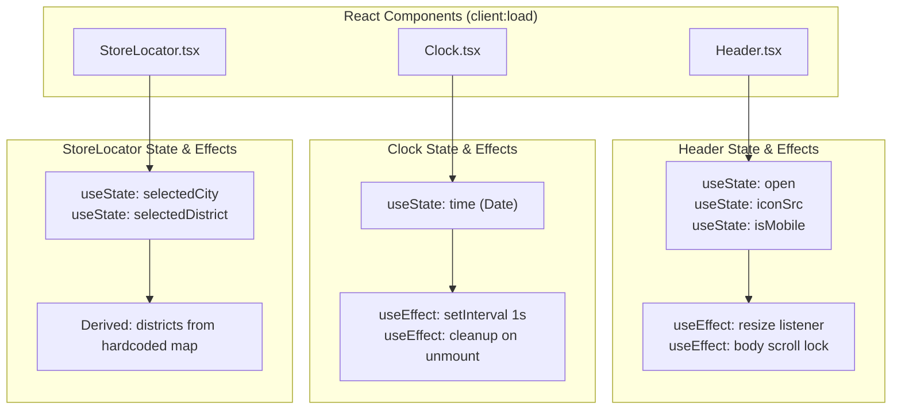

# React Components

Three React components hydrate on the client using Astro's `client:load` directive. Each is a self-contained interactive island with its own state and side effects.

---

## Component Overview



---

## Component Details

### Header (`Header.tsx`)

| Aspect | Details |
|--------|---------|
| **State** | `open` (boolean), `iconSrc` (string), `isMobile` (boolean) |
| **Effects** | Window resize listener, body overflow lock |
| **Render** | Logo, menu toggle button, slide-in panel with 4 links |
| **File** | `src/components/Header.tsx` |

See [Header & Menu](header-and-menu.md) for full documentation.

### Clock (`Clock.tsx`)

| Aspect | Details |
|--------|---------|
| **State** | `time` (Date object) |
| **Effects** | `setInterval` every 1000ms, cleanup on unmount |
| **Render** | Analog clock face + digital time + date string |
| **File** | `src/components/Clock.tsx` |

See [Clock](clock.md) for full documentation.

### StoreLocator (`StoreLocator.tsx`)

| Aspect | Details |
|--------|---------|
| **State** | `selectedCity` (string), `selectedDistrict` (string) |
| **Events** | City select resets district; district select updates |
| **Data** | 5 cities, 4-5 districts each (hardcoded) |
| **Render** | Two cascading dropdowns + submit button + icons |
| **File** | `src/components/StoreLocator.tsx` |

See [Store Locator](store-locator.md) for full documentation.

---

## Adding a New React Component

1. Create the component file in `src/components/`:

```tsx
// src/components/MyCounter.tsx
import { useState } from 'react'

export default function MyCounter() {
  const [count, setCount] = useState(0)
  return (
    <div>
      <p>Count: {count}</p>
      <button onClick={() => setCount(c => c + 1)}>+</button>
    </div>
  )
}
```

2. Import and use it in any page with `client:load`:

```astro
---
import MyCounter from '../components/MyCounter';
---

<MyCounter client:load />
```

3. Add component styles in `src/styles/components/`:

```css
/* src/styles/components/mycounter.css */
.my-counter {
  color: var(--cream);
}
```

4. Import the CSS in `core.css`.

---

## Rules for React Components

- **No prop drilling** — each island manages its own state
- **Always clean up effects** — return a cleanup function from `useEffect`
- **Keep it small** — large components defeat the purpose of islands
- **TypeScript** — define types/interfaces for any props or state
