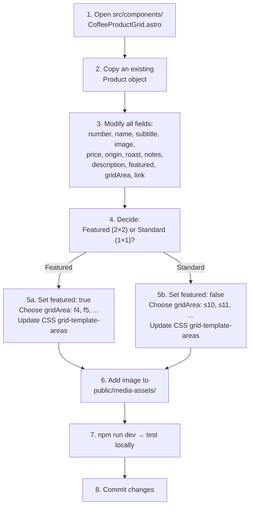

# Adding Products

This guide walks through adding a new coffee product to the editorial grid.

---

## Process Flow



> **Note:** Currently, only 3 featured and 9 standard cards are defined. Adding more requires updating the CSS grid.

---

## Product Object Template

Copy this into the `products` array and fill in your values:

```tsx
{
  number: '13',                         // Next sequential number
  name: 'Your Product',                 // Display name
  subtitle: 'Your Subtitle',            // Tagline (uppercase in CSS)
  image: 'your-image.png',              // File in public/media-assets/
  price: '₩7,500',                      // Price string
  origin: 'Origin Region',              // Origin location
  roast: 'Medium',                      // One of: Light, Light-Medium, Medium, Medium-Dark, Dark, Cold Brew
  notes: ['Note1', 'Note2', 'Note3'],  // 2–3 flavor notes
  description: 'Short tasting description...',  // 1 sentence
  featured: false,                      // true = large card, false = small card
  gridArea: 's10',                      // Must be unique; update CSS grid-template-areas
  link: '#',                            // Product detail page link (if any)
}
```

---

## Roast Values

| Value | Hex Color (for roast dot) |
|-------|--------------------------|
| `Light` | `#D4A574` |
| `Light-Medium` | `#B8864E` |
| `Medium` | `#8B6914` |
| `Medium-Dark` | `#6B4423` |
| `Dark` | `#3E1F0D` |
| `Cold Brew` | `#2C1810` |

---

## Grid Area Naming

- **Featured cards:** `f1`, `f2`, `f3` (2×2 cells each)
- **Standard cards:** `s1` through `s9` (1×1 cell each)

To add a new card, you must:

1. Assign a unique `gridArea` name (e.g., `s10` or `f4`)
2. Update the CSS `grid-template-areas` in all four breakpoints in `coffeeproductgrid.css`:

```css
/* Desktop (1280px+) */
grid-template-areas:
  'f1  f1  s1  s2'
  'f1  f1  s3  s4'
  's5  s6  f2  f2'
  's7  s8  f2  f2'
  'f3  f3  s9  s10'     /* ← add new cell */
  'f3  f3  .   .';
```

Repeat for tablet (3-col), mobile (2-col), and small mobile (1-col) breakpoints.

---

## Image Guidelines

- **Format:** PNG or JPG
- **Location:** `public/media-assets/`
- **Reference:** Use only the filename in `image` field (e.g., `'coldbrew.png'`)
- **Style:** Product images look best with transparent backgrounds (PNG)
- **Size:** Optimize to under 200 KB for fast loading

---

## Testing

```bash
cd astro
npm run dev
# Navigate to http://localhost:4321
# Scroll to the product grid section
# Verify: image loads, text is correct, hover overlay works
```

---

## Example: Adding "Ethiopian Natural"

```tsx
{
  number: '13',
  name: 'Ethiopian Natural',
  subtitle: 'Berry Bomb',
  image: 'coffee1.png',
  price: '₩9,000',
  origin: 'Ethiopia Guji',
  roast: 'Light',
  notes: ['Strawberry', 'Wine', 'Cocoa'],
  description: 'Intensely fruity with a wine-like complexity and smooth finish.',
  featured: false,
  gridArea: 's10',
  link: '#',
}
```
