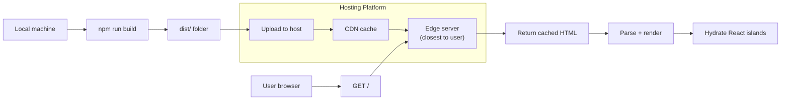

# Static Hosting

The CyZerO site produces a fully static `dist/` folder that can be deployed to any web server or CDN.

---

## Deployment Flow



---

## Platform Guides

### Netlify

1. Push the repository to GitHub/GitLab/Bitbucket
2. Log in to [Netlify](https://netlify.com) → **Add new site** → **Import an existing project**
3. Select your repository
4. Configure:

| Setting | Value |
|---------|-------|
| Base directory | `astro` |
| Build command | `npm run build` |
| Publish directory | `astro/dist` |

5. Click **Deploy site**

Netlify detects the Astro framework automatically and applies optimal settings.

### Vercel

1. Push the repository to GitHub/GitLab/Bitbucket
2. Log in to [Vercel](https://vercel.com) → **Add New Project**
3. Import your repository
4. Configure:

| Setting | Value |
|---------|-------|
| Framework preset | Astro |
| Root directory | `astro` |
| Build command | `npm run build` |
| Output directory | `dist` |

5. Click **Deploy**

### Cloudflare Pages

1. Push the repository to GitHub/GitLab
2. Log in to [Cloudflare Pages](https://pages.cloudflare.com) → **Create a project**
3. Connect your Git provider and select the repository
4. Configure:

| Setting | Value |
|---------|-------|
| Framework preset | Astro |
| Root directory | `astro` |
| Build command | `npm run build` |
| Build output directory | `dist` |

5. Click **Save and Deploy**

### Manual / Any Host

```bash
cd astro
npm run build
# Upload the entire dist/ folder to your web server
# via FTP, SCP, or a deployment tool
```

---

## Post-Deployment

### Verify the Deployment

```bash
# Check the site responds
curl -I https://your-domain.com

# Check specific pages
curl -s https://your-domain.com/ | head -20
curl -s https://your-domain.com/clock | head -10
curl -s https://your-domain.com/slider | head -10
```

### Set a Custom Domain

Most platforms let you add a custom domain in the dashboard. Add a `CNAME` record pointing to your platform's domain (e.g., `your-site.netlify.app`).

### Enable HTTPS

All three platforms provide free SSL certificates via Let's Encrypt. Enable it in the dashboard settings.

---

## Cache Control

For optimal performance, configure your CDN to cache static assets aggressively:

```
# Assets with content hashes can be cached forever
/_astro/*               Cache-Control: public, max-age=31536000, immutable

# HTML pages should be revalidated
/*.html                 Cache-Control: public, max-age=0, must-revalidate
```

Netlify and Vercel apply these rules automatically for Astro outputs.

---

## Environment-Specific URLs

| Environment | URL |
|------------|-----|
| Local dev | `http://localhost:4321` |
| Production | Your custom domain |
| Preview (Netlify) | `https://branch-name--repo-name.netlify.app` |
| Preview (Vercel) | `https://project-name.vercel.app` |
