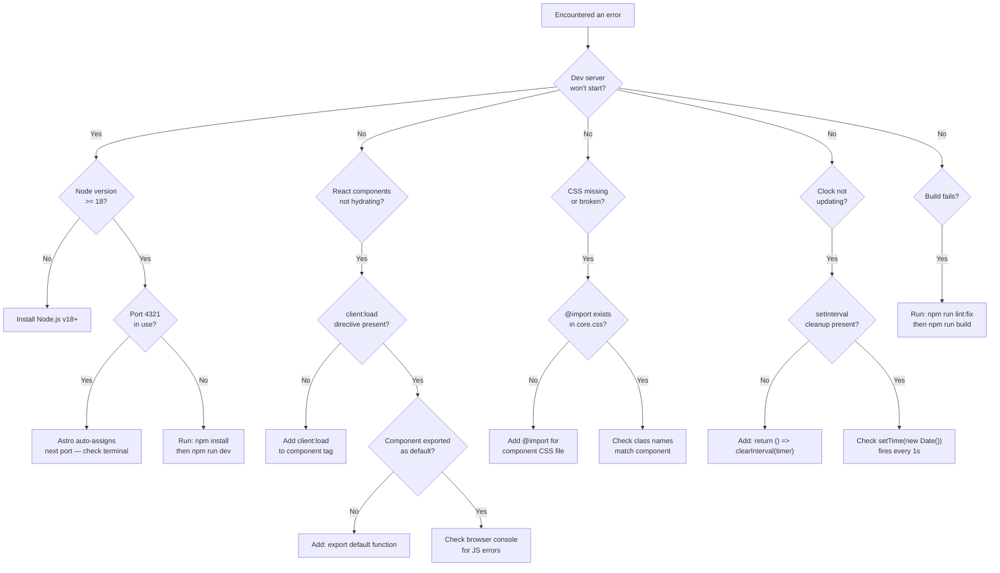

# Troubleshooting

Common issues, their causes, and solutions.

---

## Error Decision Tree



---

## Common Issues

### 1. Dev Server Won't Start

| Symptom | Cause | Solution |
|---------|-------|----------|
| `Error: Could not find module 'astro'` | Dependencies not installed | Run `npm install` |
| `Node.js version >= 18 required` | Outdated Node.js | Upgrade to v18 LTS or higher |
| `Port 4321 is already in use` | Another process on that port | Let Astro auto-assign, or kill the process |
| `EACCES: permission denied` | npm permissions issue | Run `npm install --legacy-peer-deps` or use nvm |

### 2. React Components Don't Hydrate

| Symptom | Cause | Solution |
|---------|-------|----------|
| Menu button does nothing | `client:load` missing | Add `client:load` to `<Header />` |
| Clock shows static time | No interval running | Check `setInterval` in `useEffect` |
| Store dropdowns don't work | Component not default export | Ensure `export default function StoreLocator()` |

### 3. CSS Not Applied

| Symptom | Cause | Solution |
|---------|-------|----------|
| Section has no styles | CSS file not imported in `core.css` | Add `@import './components/yourfile.css';` |
| Wrong colors showing | CSS variables not loaded | Check `core.css` imports `colors.css` |
| Layout broken on mobile | Missing media query breakpoint | Add responsive styles in `media.css` |

### 4. Images Not Loading

| Symptom | Cause | Solution |
|---------|-------|----------|
| 404 on image | Wrong path | Ensure path starts with `/media-assets/` |
| Image not in build | File missing from `public/` | Add file to `public/media-assets/` |
| Broken image icon | Typo in filename | Check exact filename (case-sensitive) |

### 5. Build Errors

| Symptom | Cause | Solution |
|---------|-------|----------|
| `Type error: ...` | TypeScript compilation error | Fix the type error or run `npm run lint:fix` |
| `Could not resolve entry module` | Missing import | Check all imports resolve to existing files |
| Build succeeds but page is blank | Component syntax error | Check browser console for errors |

### 6. Slider Not Working

| Symptom | Cause | Solution |
|---------|-------|----------|
| Sections don't snap | `scroll-snap-type` not recognized | Test in Chrome/Firefox (Safari may behave differently) |
| Images too large | No max-height constraint | Ensure `max-width: 80%; max-height: 80%` on images |

### 7. Clock Display Issues

| Symptom | Cause | Solution |
|---------|-------|----------|
| Hands don't rotate | `transform-origin` missing | Set `transform-origin: bottom center` on `.hand` |
| Time doesn't update | `setInterval` not called | Check `useEffect` dependency is `[]` |
| Wrong time zone | Server-side rendering | Clock runs client-side — matches user's local time |

---

## Quick Fixes

```bash
# Restart cleanly
cd astro
rm -rf node_modules .astro
npm install
npm run dev

# Force a fresh build
npm run build

# Check for lint errors
npm run lint:fix
```

---

## Getting Help

If the issue persists:

1. Check the browser console for JavaScript errors
2. Check the terminal output for build errors
3. Verify your Node.js version: `node --version`
4. Verify file paths and imports match exactly
