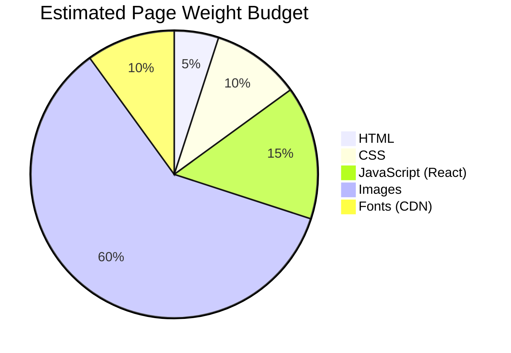

# Performance Optimization

Guidelines for keeping the CyZerO site fast and lightweight.

---

## Performance Budget



> **Estimated total:** ~1.5–2.5 MB per page (dominated by hero + background images)

---

## Current Optimization Measures

### 1. Static Generation

All pages are pre-rendered to HTML at build time. There is no server-side rendering overhead per request.

### 2. Minimal JavaScript

Only 3 React components hydrate, and only on pages that need them:

| Page | JS Hydrated |
|------|------------|
| Home | `Header.tsx` + `StoreLocator.tsx` |
| Clock | `Header.tsx` + `Clock.tsx` |
| Slider | `Header.tsx` |

### 3. Lazy Loading

Images below the fold use `loading="lazy"`:

```astro

```

### 4. Font Optimization

- `preconnect` hints for font CDNs
- `display=swap` for Google Fonts (text renders immediately with fallback)
- Variable fonts reduce the number of font file downloads

### 5. Content Hashing

Build output filenames include content hashes for cache busting:

```
Clock.Rqz9Iw_Y.js   → changes only when Clock.tsx changes
```

---

## Optimization Opportunities

### Images (highest impact)

| Technique | Benefit |
|-----------|---------|
| **Compress PNGs** | Use `pngquant` or Squoosh to reduce product image sizes |
| **Use AVIF/WebP** | Modern formats offer 30–50% smaller files than JPEG |
| **Resize hero image** | `home.jpg` is large — serve responsive sizes with `<picture>` |
| **Lazy load all below-fold** | Already done — verify with DevTools |

### CSS

| Technique | Benefit |
|-----------|---------|
| **Purge unused CSS** | Many styles are imported but may not be used on every page |
| **Inline critical CSS** | Extract above-the-fold styles for faster first paint |

### JavaScript

| Technique | Benefit |
|-----------|---------|
| **Code splitting** | Already built-in (each React island is a separate chunk) |
| **Defer non-critical JS** | Already done — React loads after HTML |

### Fonts

| Technique | Benefit |
|-----------|---------|
| **Subset fonts** | Korean fonts are large — subsetting reduces size significantly |
| **Preload key fonts** | Add `<link rel="preload">` for the most important font |

---

## Measuring Performance

```bash
# Use Lighthouse in Chrome DevTools
# Or run from CLI:
npx lighthouse http://localhost:4321 --view

# Check bundle size:
npx astro build
du -sh dist/_astro/
```

---

## Critical Metrics to Monitor

| Metric | Target |
|--------|--------|
| First Contentful Paint (FCP) | < 1.5s |
| Largest Contentful Paint (LCP) | < 2.5s |
| Total Blocking Time (TBT) | < 200ms |
| Cumulative Layout Shift (CLS) | < 0.1 |
| JavaScript bundle | < 50 KB gzipped |
| Page weight | < 2 MB |
