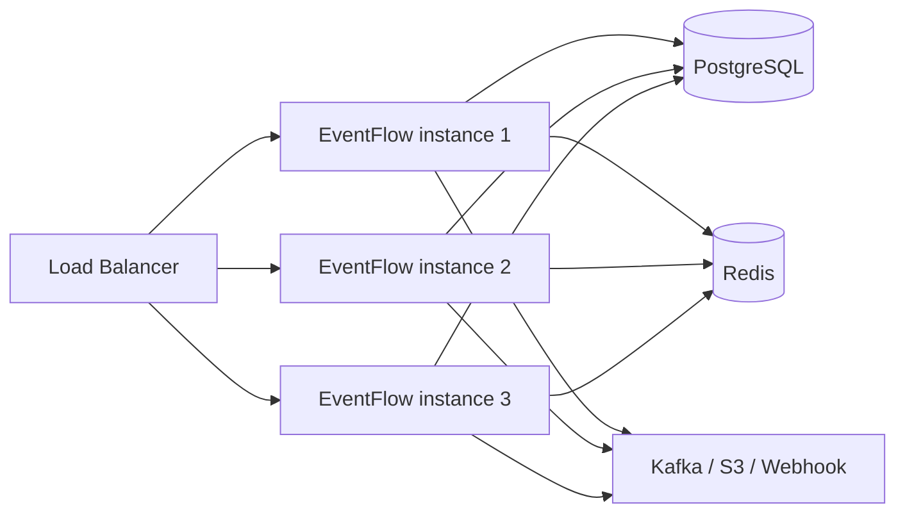

# Scaling

EventFlow is designed to scale horizontally with minimal operational overhead.

## Horizontal scaling

EventFlow is **stateless** for event ingestion and processing. State is externalized to PostgreSQL (rules, schema) and Redis (rate limiting, idempotency). This means you can add more instances behind a load balancer without any coordination.



## Scaling sinks

### Kafka

When forwarding to Kafka, each EventFlow instance acts as a producer. EventFlow uses the `hash` partitioner by default so that events with the same `id` are sent to the same partition, preserving order per event ID.

Increase throughput by adding partitions to your Kafka topic.

### S3

The S3 sink batches events before uploading. Larger batches reduce request costs but increase latency. Tune `batch_size` and `batch_max_wait` for your throughput:

```yaml
- name: archive
  type: s3
  config:
    batch_size: 2000
    batch_max_wait: 120s
```

### Webhook

Webhook sinks use a worker pool (default 10 workers per sink). Increase with the `workers` config:

```yaml
- name: alert
  type: webhook
  config:
    url: https://hooks.example.com
    workers: 50
```

## API key management

API keys are stored in PostgreSQL, so they are available to all instances. Use the `eventflow keys` CLI on any instance to create or revoke keys.

## Load balancing HTTP ingestion

Use a round-robin or least-connections load balancer:

```nginx
upstream eventflow_backend {
    least_conn;
    server 10.0.1.10:8080;
    server 10.0.1.11:8080;
    server 10.0.1.12:8080;
}

server {
    listen 443 ssl;
    location / {
        proxy_pass http://eventflow_backend;
    }
}
```

## Monitoring backpressure

Watch the following signals to know when to scale:

| Signal | Metric | Action |
|---|---|---|
| High HTTP latency | `eventflow_sink_latency_seconds` p99 > 1s | Add more instances |
| Connections maxed out | `eventflow_active_connections` near limit | Add more instances or increase limit |
| High memory usage | process RSS > 80% of limit | Increase instance memory |
| Sink errors rising | `eventflow_sink_errors_total` | Check sink health before scaling |

## Autoscaling (Kubernetes)

```yaml
apiVersion: autoscaling/v2
kind: HorizontalPodAutoscaler
metadata:
  name: eventflow
spec:
  scaleTargetRef:
    apiVersion: apps/v1
    kind: Deployment
    name: eventflow
  minReplicas: 2
  maxReplicas: 10
  metrics:
    - type: Resource
      resource:
        name: cpu
        target:
          type: Utilization
          averageUtilization: 70
    - type: Resource
      resource:
        name: memory
        target:
          type: Utilization
          averageUtilization: 80
```

## Rate limiting per instance

Rate limits are tracked in Redis, making them accurate across all instances. Redis is a single point of state – ensure it is properly replicated or use a managed Redis cluster for high availability.
