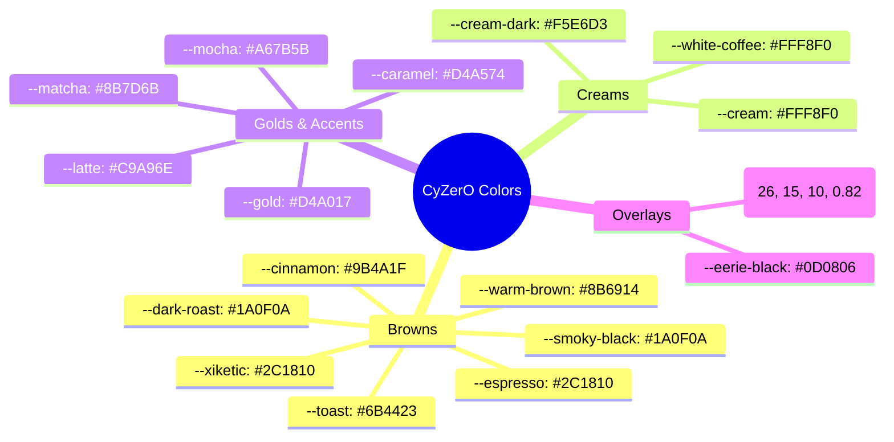

# Color Palette

The CyZerO design language is built around a warm, coffee-inspired color palette defined as CSS custom properties in `src/styles/themes/colors.css`.

---

## Color Token Relationships



---

## Complete Variable Reference

### Base Colors

| Variable | Hex Value | Usage |
|----------|-----------|-------|
| `--espresso` | `#2C1810` | Secondary backgrounds, section gradients |
| `--dark-roast` | `#1A0F0A` | Main page background |
| `--smoky-black` | `#1A0F0A` | Alternative body background |
| `--xiketic` | `#2C1810` | Menu panel, clock background |
| `--eerie-black` | `#0D0806` | Overlay backdrop |

### Text & Surface Colors

| Variable | Hex Value | Usage |
|----------|-----------|-------|
| `--cream` | `#FFF8F0` | Primary text color, light surfaces |
| `--cream-dark` | `#F5E6D3` | Muted text area |
| `--white-coffee` | `#FFF8F0` | Clock hands, menu text |

### Accent Colors

| Variable | Hex Value | Usage |
|----------|-----------|-------|
| `--latte` | `#C9A96E` | Primary accent: buttons, borders, highlights |
| `--caramel` | `#D4A574` | Hover state, gradient partner with latte |
| `--mocha` | `#A67B5B` | Secondary text, muted accents |
| `--matcha` | `#8B7D6B` | Neutral accent |
| `--gold` | `#D4A017` | Special highlights |

### Warm Tones

| Variable | Hex Value | Usage |
|----------|-----------|-------|
| `--warm-brown` | `#8B6914` | Medium roast indicator |
| `--cinnamon` | `#9B4A1F` | Highlight warmth |
| `--toast` | `#6B4423` | Medium-dark roast indicator |

---

## HSL Helper Variables

```css
--hsl-purple-dark: hsl(290, 80%, 40%);
--hsl-purple-light: hsl(290, 80%, 90%);
--hsl-pink-dark: hsl(320, 80%, 40%);
--hsl-pink-light: hsl(320, 80%, 90%);
```

These are used exclusively on the **slider page** (`/slider`) for alternating section backgrounds.

---

## Color Application Patterns

### Section Separators

Subtle `1px` gradient lines separate sections:

```css
background: linear-gradient(90deg, transparent, var(--latte), transparent);
```

### Text Gradients

Hero headings use a gold gradient:

```css
background: linear-gradient(135deg, var(--latte), var(--caramel));
-webkit-background-clip: text;
-webkit-text-fill-color: transparent;
```

### Button Styles

Primary buttons use `var(--latte)` background with `var(--dark-roast)` text. Hover transitions to `var(--caramel)`.

### Borders & Dividers

Borders use `rgba(201, 169, 110, 0.15)` — the latte color at 15% opacity — blending into the dark background.

---

## Dark Background Tones at a Glance

| Level | Color | Opacity effect |
|-------|-------|----------------|
| Deepest | `--eerie-black` | Overlay backdrop |
| Page bg | `--dark-roast` | Main canvas |
| Card bg | `--espresso` | Section interiors |
| Card hover | `rgba(44, 24, 16, 0.85)` | Slightly lighter on hover |
| Overlay | `rgba(26, 15, 10, 0.82)` | Menu backdrop |
