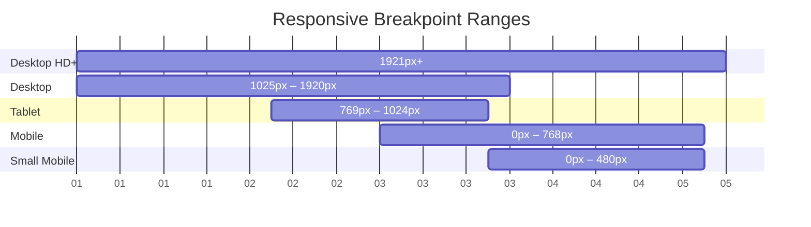

# Responsive Breakpoints

The CyZerO site adapts to four viewport ranges. All breakpoints are defined in `src/styles/layout/media.css` and per-component CSS files.

---

## Breakpoint Timeline



---

## Breakpoint Details

### 1921px+ (Ultra-wide)

**File:** `layout/media.css`

```css
@media (min-width: 1921px) {
  .main .left-content h1 { font-size: 7rem; }
}
```

- Hero heading scales to a maximum of 7rem

### 1280×720 (Small desktop / laptop)

**File:** `layout/media.css`

```css
@media (max-width: 1280px) and (max-height: 720px) {
  .coffee-container section img {
    max-width: 100%;
    max-height: 100%;
  }
}
```

- Slider images expand to fill the viewport

### ≤1024px (Tablet landscape)

**File:** `layout/media.css`

```css
@media (max-width: 1024px) {
  .container { height: 64px; }
  .main .left-content h1 { font-size: clamp(3rem, 7vw, 5rem); }
}
```

| Component | Change |
|-----------|--------|
| Header | Height reduces to 64px |
| Hero H1 | Scales down |
| Product grid | 4 → 3 columns |

### ≤768px (Mobile)

**Primary breakpoint.** Multiple files are affected:

| File | Selector | Change |
|------|----------|--------|
| `layout/container.css` | `.container` | Height 60px, padding 0 1rem |
| `layout/container.css` | `.container .logo img` | Height 28px |
| `layout/media.css` | `.menu-box ul li a` | Font size 2.5rem |
| `layout/media.css` | `.coffee-container section` | Height auto, min-height 60vh |
| `hero.css` | `.main` | Column layout, height auto |
| `hero.css` | `.main .right-content` | Full width, 50vh height |
| `hero.css` | `.main .left-content::after` | Left position 1.5rem |
| `coffeeproductgrid.css` | `.editorial-grid` | 4 → 2 columns |
| `clock.css` | `.analog-clock` | 300px → 220px |
| `clock.css` | `.digital-time` | 4rem → 2.5rem |
| `clock.css` | Hand heights | Reduced proportionally |
| `brandstory.css` | `.brand-story-content` | 2-column → 1-column |
| `featuredproducts.css` | `.featured-products-content` | 2-column → 1-column, image on top |
| `qualitystory.css` | `.quality-story-item` | 2-column → 1-column, LTR direction |
| `storelocator.css` | (no specific change — form stacks naturally) | — |
| `instagramfeed.css` | `.instagram-grid` | 3 → 2 columns |
| `newssection.css` | `.news-featured` | 2-column → 1-column |
| `footer.css` | `.footer-content` | 4 → 2 columns |

### ≤480px (Small mobile)

| File | Component | Change |
|------|-----------|--------|
| `coffeeproductgrid.css` | `.editorial-grid` | 2 → 1 column |
| `footer.css` | `.footer-content` | 2 → 1 column |

---

## Key Patterns

### Clamp Functions

The project uses CSS `clamp()` for fluid typography throughout:

```css
.main .left-content h1 {
  font-size: clamp(4rem, 8vw, 7rem);
}
```

| Property | Clamp Pattern |
|----------|---------------|
| Hero H1 | `clamp(4rem, 8vw, 7rem)` |
| Section H2 | `clamp(2rem, 4vw, 4rem)` |
| Section H3 | `clamp(1.6rem, 3vw, 2.2rem)` |
| Product name | `clamp(1.4rem, 2.5vw, 2rem)` |

### Mobile Menu

On mobile (<768px), the slide-in menu expands to **100% width** (vs. 35% on desktop). This is handled via a CSS class toggled by the React component:

```tsx
const isMobile = window.innerWidth < 768
const menuClass = `menu-box ${open ? 'open-menu' : ''}${open && isMobile ? ' mobile-full' : ''}`
```

---

## Testing Breakpoints

```bash
# Open Chrome DevTools → Toggle Device Toolbar (Ctrl+Shift+M)
# Test at:
# - 1920×1080 (desktop)
# - 1280×720 (small laptop)
# - 1024×768 (tablet landscape)
# - 768×1024 (tablet portrait)
# - 375×667 (mobile)
# - 320×568 (small mobile)
```
